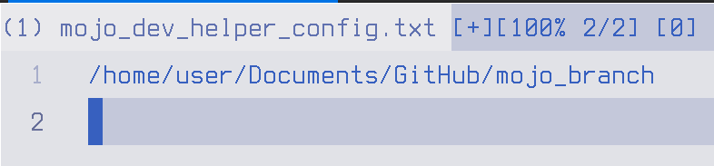
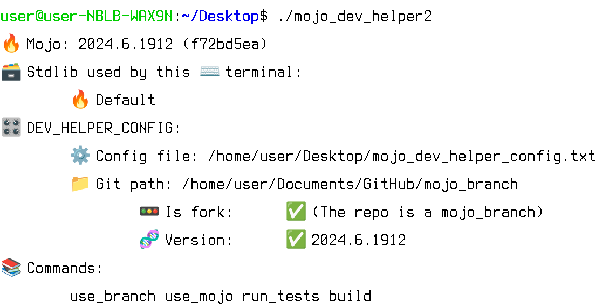

# 🦺 mojo_dev_helper
It is a small tool for stdlib contributors.

Feel free to modify it and make it your own !

It is super easy to tweak and add new commands.

For example: `print( "Branch: ", (repo/".git"/"HEAD").read_text() )`

# 1️⃣  Create a `mojo_dev_helper_config.txt` config_file
For example: /home/user/Desktop/mojo_dev_helper_config.txt

# 2️⃣  Edit it and add your mojo_branch into it

For example: /home/user/Documents/GitHub/mojo_branch

# 3️⃣  Build the tool but specify the config file with -D `config_file`
For example:

`
mojo build -D config_path="/home/user/Desktop/mojo_dev_helper_config.txt" mojo_dev_helper.mojo
`

# 4️⃣  Use the app
For example `./mojo_dev_helper`

It tells if mojo in the current terminal will uses your branch or not.

Also if the branch version match with the current mojo version.

# 5️⃣  Create a symlink or add it to `PATH` 
That way, you'll be able to use the app from anywhere.

# 📖 Commands
`build`
It builds the branch.

`run_tests`
Runs the branch tests (`stdlib/scripts/run-tests.sh`)

`use_branch`
Gives what command to use in the terminal to tell mojo to use the branch.
So that mojo in the current terminal will use it to run programs.
That way, you'll be able to do `mojo run my_app.mojo` with the branch!

`use_mojo`
Gives what command to use in the terminal to tell mojo to not use the branch.
That way, mojo in the current terminal will be default.
